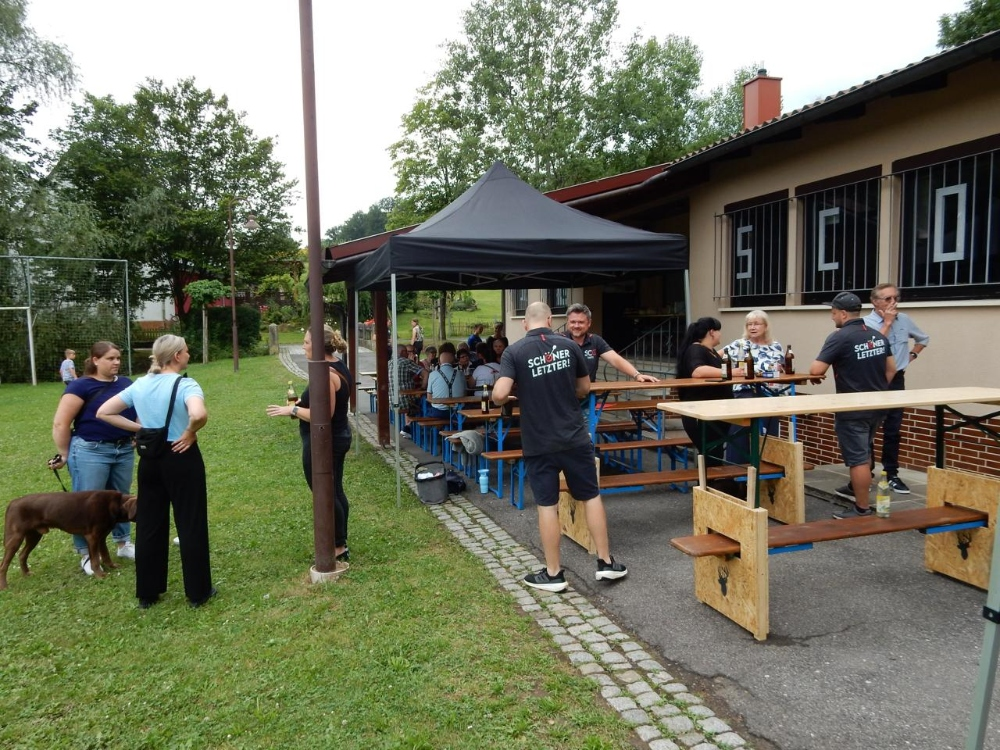
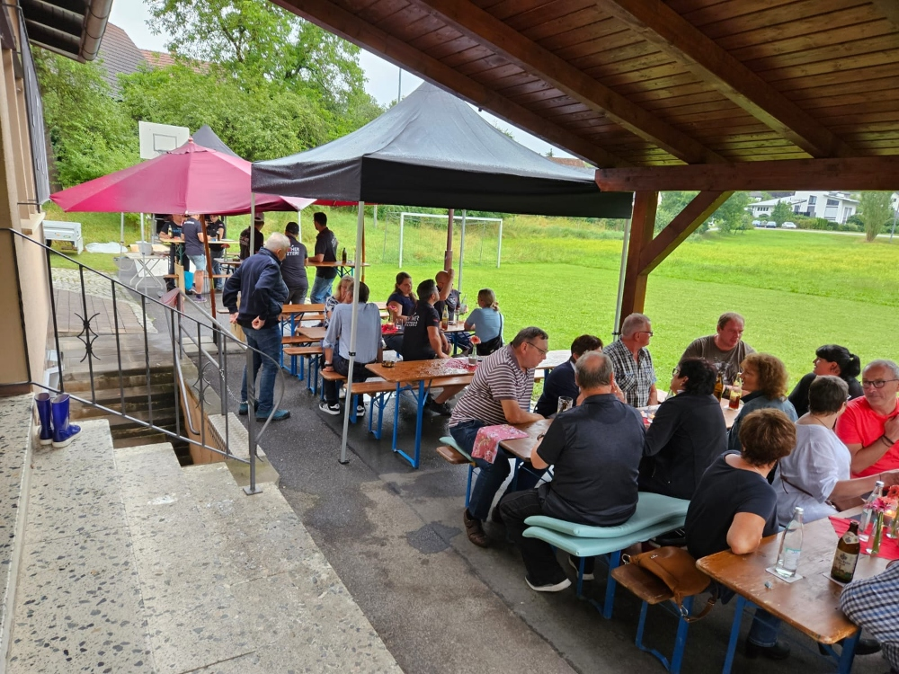
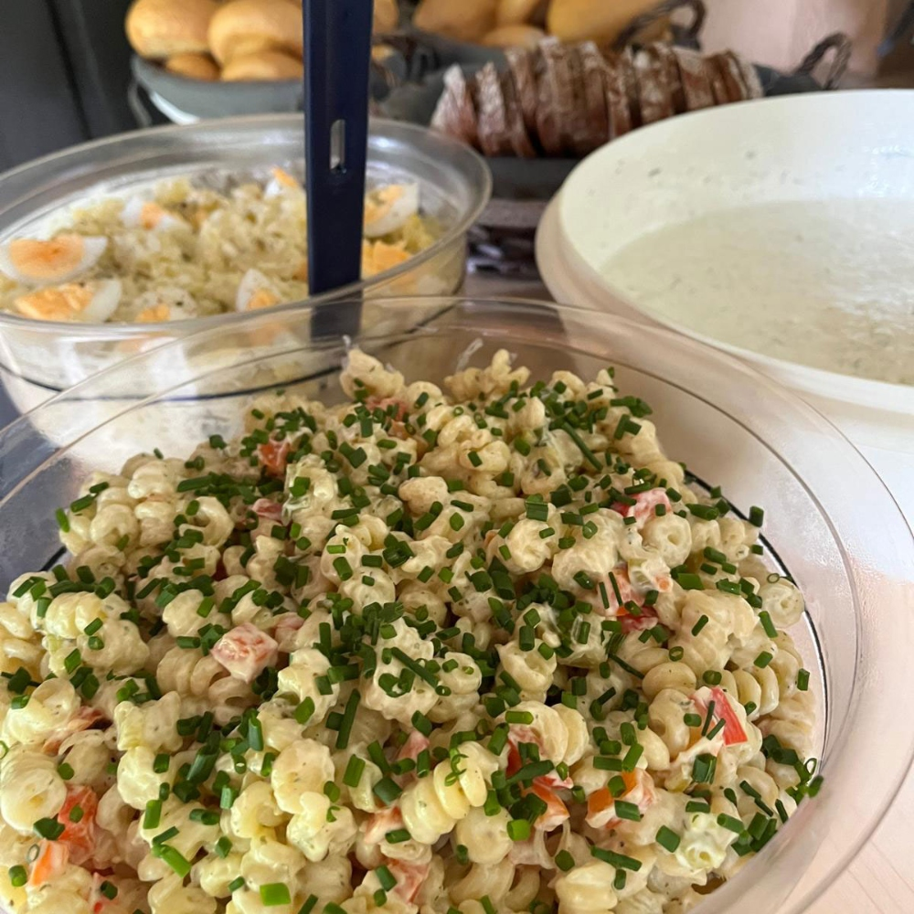
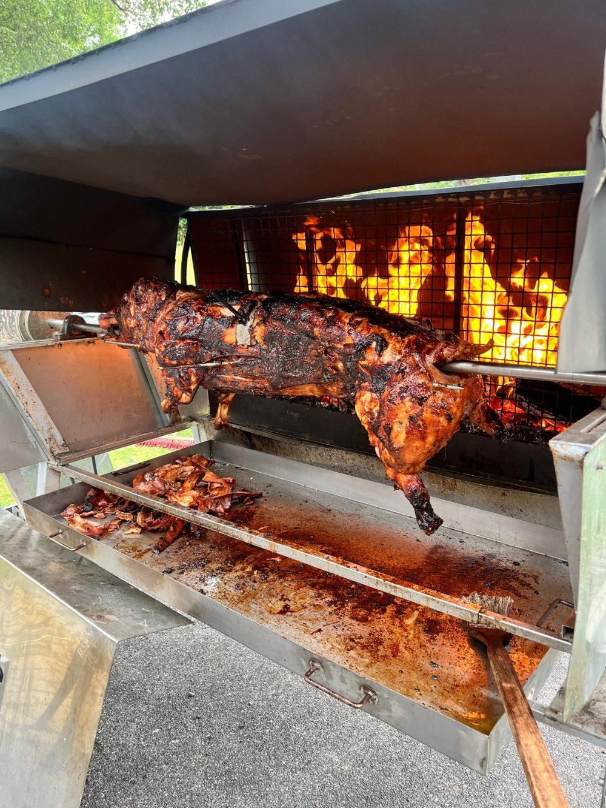
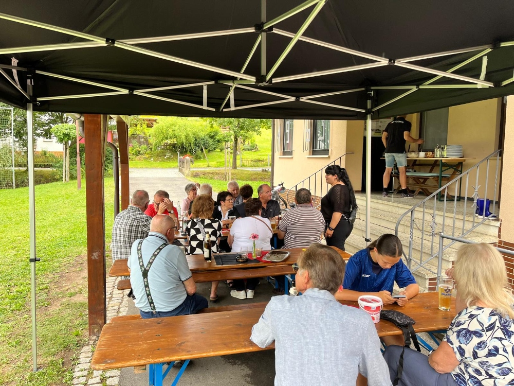

## 🐖 Spanferkel-Essen beim SC-Oberfüllbach
Am 27. Juli fand unser zweites Spanferkel-Essen am Sportheim in Oberfüllbach statt. Bereits ab 10 Uhr morgens begannen die Vorbereitungen. Nachdem alles aufgebaut war, begann Christoph mit dem Grillen des Spanferkels, das den ganzen Tag über einen köstlichen Duft verbreitete.

## 👥 Gemütliches Beisammensein
Rund 40 Gäste fanden sich ein und genossen das gemütliche Beisammensein im Freien. Unter Pavilions geschützt, konnten wir auch den Abendregen unbeschwert erleben. Eine bunt gemischte Musikauswahl sorgte für eine stimmungsvolle Atmosphäre.

## 🎯 Organisiert von den Dartern
Die Darter des SC-Oberfüllbach organisierten das Event, und eingeladen waren auch die Mitglieder des Stammtischs sowie ihre Familien. Neben dem Spanferkel gab es eine Vielzahl an leckeren Beilagen wie Sauerkraut, Brötchen und Salate, die das kulinarische Angebot abrundeten.

## 👍 Positive Rückmeldungen
Das Feedback war durchweg positiv, und wir freuen uns darauf, auch in Zukunft ähnliche Veranstaltungen durchzuführen.

## 🙏 Dank an Christoph
Ein besonderer Dank gilt Christoph, der wie im letzten Jahr das Besorgen, Vorbereiten, Würzen und Grillen des Spanferkels übernommen hat.

