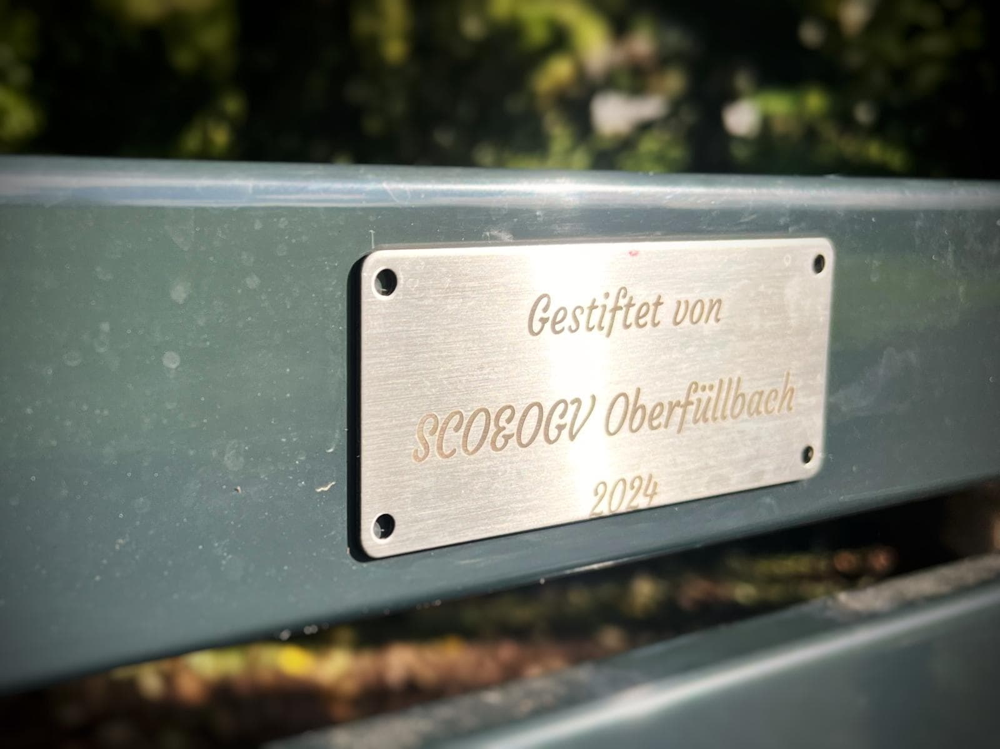

## 🏞️ Neue Sitzbänke am Füllbach: Ein Ort der Ruhe und Entspannung

Mitte September konnten die vom **SCO&OGV Oberfüllbach** gestifteten Sitzbänke eingeweiht werden. 

Die beiden Sitzgelegenheiten stehen entlang der **Füllbach** am Fuß- und Radweg zwischen „An der Linde“ und der „Schafgasse“. Durch die Erweiterung der Sitzmöglichkeiten soll allen Dorfbewohnern und Durchreisenden eine zusätzliche Möglichkeit für eine kurze Ruhepause mit Blick ins Grüne und entspannendem Bachgeplätscher geboten werden. 

Ein herzlicher Dank gilt dabei der **Gemeinde Ebersdorf** sowie den Mitarbeitern des gemeindlichen Bauhofes, die neben der sehr schönen Erneuerung des Fuß- und Radweges auch das Aufstellen der Bänke übernommen haben.

